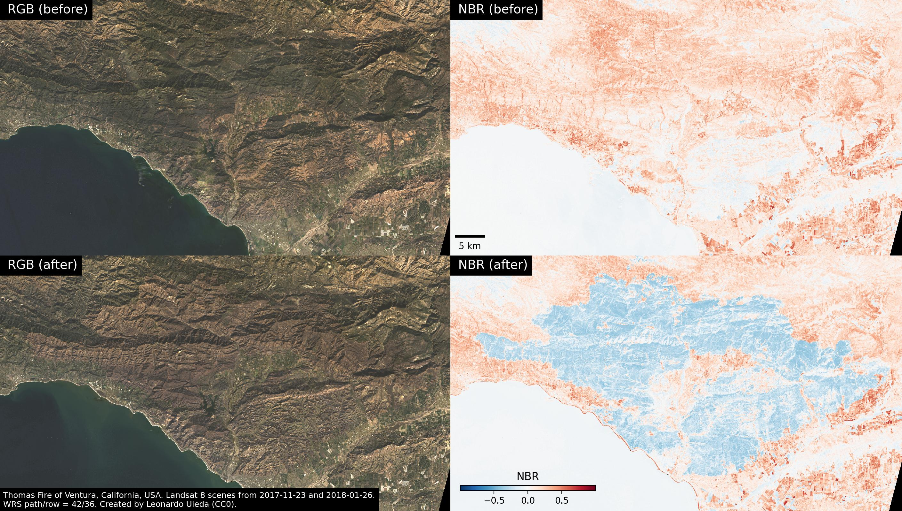

# Plot Landsat 8 scenes of the Thomas Fire

Download some selected Landsat 8 scenes that show the before and after of the
fire and make plots to show what's going on.
Uses [xlandsat](https://www.compgeolab.org/xlandsat) to load the scenes and
make composites.

The scenes were downloaded from [USGS Earth Explorer](https://earthexplorer.usgs.gov/)
and archived on figshare: https://doi.org/10.6084/m9.figshare.21930384

<figure>

<figcaption>
Comparison of RGB composites and normalized burn ratio (NBR) before and after the fire.
The burned region can be easily picked out in blue in the NBR.
</figcaption>
</figure>

## License

All Python source code is made available under the
[MIT license](https://github.com/compgeolab/thomas-fire-landsat-2017/blob/main/LICENSE).
You can freely use and modify the code, without warranty, so long as you provide
attribution to the authors.

Unless otherwise specified, all figures and Jupyter notebooks are available under the
[Creative Commons Public Domain Dedication (CC0)](https://creativecommons.org/publicdomain/zero/1.0/).
